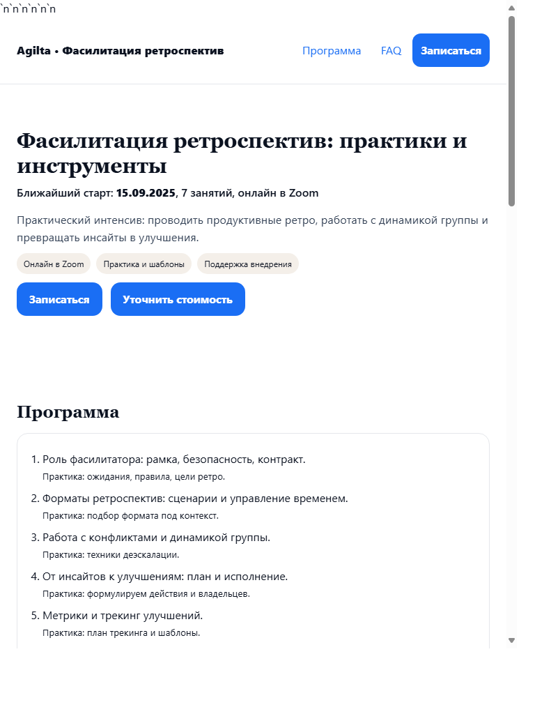
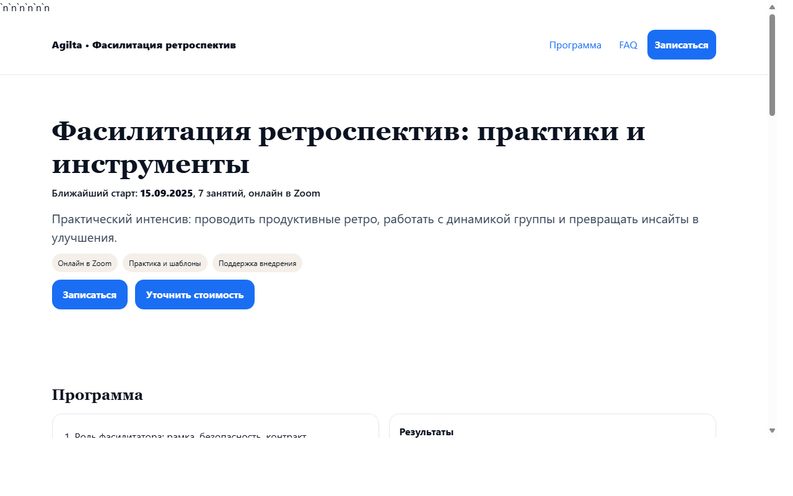
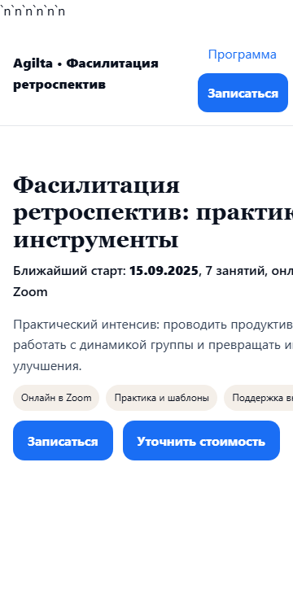

# Agilta — Ретроспективы, которые ведут к росту (лендинг + процессы)

[](https://github.com/merkulovid-ux/retrospective/actions)
[](https://github.com/merkulovid-ux/retrospective/actions/workflows/smoke.yml)
[](https://github.com/merkulovid-ux/retrospective/actions/workflows/e2e.yml)

- Живой лендинг курса/вебинара о ретроспективах для команд (коучинговая фасилитация, A11y, перфоманс, CI).
- Паблик URL: https://merkulovid-ux.github.io/retrospective/

## Структура
- `index.html` — основной лендинг (герой, разделы, ссылки, FAQ)
- `site/offline.html` — оффлайн‑страница
- `docs/` — документация и артефакты
  - `docs/sprint/` — планы/ревью/ретро спринтов
  - `docs/research/mobile-nav-2025.md` — исследование по мобильной навигации (2025)
  - `docs/roles_workflow_raci.md`, `docs/consent.md`
- `scripts/smoke.js` — быстрый smoke‑чек
- `.github/workflows/` — CI (Smoke/E2E/Lighthouse)

## Локальный запуск (быстрый)
```
# 1) стартуем статический сервер
npx http-server -p 8080 .
# 2) smoke‑проверка (индекс/оффлайн)
node scripts/smoke.js http://127.0.0.1:8080/index.html
```

## Тесты
- Playwright: `npm run test:e2e` (есть `tests/mobile-nav.spec.ts` для мобильного меню)
- В CI: workflows “E2E”, “Smoke”

## Навигация (мобильная, 2025)
- Паттерн: узкий side‑sheet справа, кнопка «Меню» в шапке на ширинах `<860px`.
- A11y: `aria-expanded/controls`, trap‑focus, закрытие по ESC/overlay/крестику, `inert` на контенте при открытии.
- Motion: токены `--motion-150/200/250`, уважается `prefers-reduced-motion`.
- Safe‑area: `env(safe-area-inset-*)`, высота — `dvh`/`vh`.

## Скриншоты
Light 360 | Light 768 | Light 1280
:--:|:--:|:--:
 |  | 

Dark 360 | Dark 768 | Dark 1280
:--:|:--:|:--:
 |  | 

